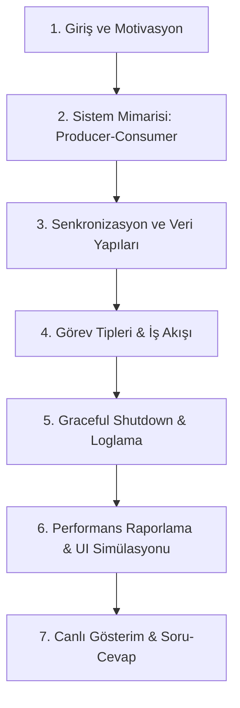
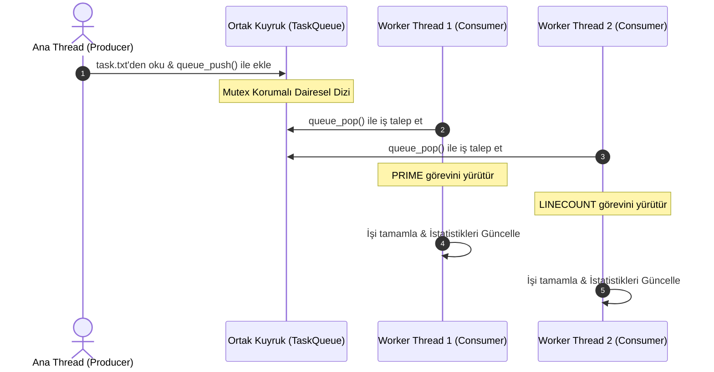

# Thread Pool Tabanlı Paralel Görev İşleyici - Proje Sunumu

Bu belge, **Sistem Programlama** dersi projenizin sunumunda kullanabileceğiniz, projenin tüm teknik detaylarını, mimarisini ve sistem programlama kavramlarını adım adım açıklayan kapsamlı bir sunum kılavuzudur. Sunumu slaytlar halinde veya doğrudan bu doküman üzerinden hocanıza gösterebilirsiniz.

---

## 📌 Sunum İçeriği ve Akışı



---

## 📂 Slayt 1: Giriş ve Motivasyon (Neden Thread Pool?)

### Thread Nedir ve Neden Bir "Havuz" (Pool) Gereklidir?
* **Geleneksel Yaklaşım:** Her yeni iş (task) geldiğinde yeni bir thread yaratmak (`pthread_create`) ve iş bitiminde onu yok etmek (`pthread_join`/`pthread_exit`) çok yaygın bir yöntemdir.
* **Maliyet Problemi:** İşletim sisteminde (OS) thread yaratma ve silme işlemleri pahalı sistem çağrılarıdır (overhead). Sürekli thread yaratılıp silinmesi işlemci ve bellek kaynaklarını tüketir.
* **Çözüm (Thread Pool):** 
  * Program başlarken **belirli sayıda worker (işçi) thread** (`num_threads`) bir kez oluşturulur ve arka planda hazır bekletilir.
  * İşler ortak bir **görev kuyruğuna (TaskQueue)** atılır.
  * Hazır bekleyen thread'ler kuyruktan sırayla iş alıp işler. İş bitince thread yok edilmez, bir sonraki görevi almak üzere kuyruğa geri döner.
  * Bu sayede sistem kaynakları optimize edilir ve yüksek performans elde edilir.

---

## ⚙️ Slayt 2: Sistem Mimarisi & Tasarım Deseni (Producer-Consumer)

Proje, çoklu programlama dünyasının en temel desenlerinden biri olan **Üretici-Tüketici (Producer-Consumer)** mimarisi üzerine kurulmuştur:



### 1. Üretici (Producer - Ana Thread)
* `src/main.c` dosyasında çalışır.
* `tasks.txt` dosyasını satır satır okur, görevleri parse eder.
* Görevleri `queue_push()` fonksiyonunu kullanarak ortak kuyruğa güvenli bir şekilde ekler.

### 2. Ortak İş Kuyruğu (TaskQueue)
* `src/queue.c` ve `include/queue.h` modülünde yer alır.
* **Dairesel Dizi (Circular Array)** veri yapısını kullanır.
* Thread-safe (Thread güvenli) olacak şekilde `pthread_mutex_t` ile korunur.

### 3. Tüketiciler (Consumer - Worker Threads)
* `src/thread_pool.c` modülünde yönetilir.
* Havuzdaki her thread, sürekli olarak kuyruktan iş çekmeye çalışır (`queue_pop`).
* Kendisine gelen görevi çalıştırır (`process_task`), sonuçları raporlar ve bir sonraki iş için hazır hale gelir.

---

## 🔒 Slayt 3: Veri Yapıları ve Senkronizasyon (Kritik Bölge Yönetimi)

Birden çok thread aynı bellek bölgesine aynı anda erişmeye çalıştığında **Race Condition (Yarış Durumu)** oluşur. Bu projede, bu durumu engellemek için iki temel POSIX aracı kullanılmıştır:

### 1. Mutex (Karşılıklı Dışlama)
* Kuyruk üzerindeki ekleme (`queue_push`) ve çıkarma (`queue_pop`) işlemleri sırasında kuyruk verilerinin (front, rear, count) bozulmasını engellemek için `pthread_mutex_t mutex` kilidi kullanılır.
* **Logger Modülü (`src/logger.c`):** Log dosyasına (`log.txt`) ve ekrana (`stdout`) yazma işlemlerinin birbirine girmemesi için logger da özel bir mutex ile korunur.
* **İstatistik Modülü:** Toplam işlenen görev sayısı ve thread bazlı istatistik güncellemeleri için `stats_mutex` kullanılmıştır.

### 2. Condition Variables (Koşul Değişkenleri ile Etkin Bekleme)
* **Busy-Waiting (Gereksiz CPU Tüketimi) Önleme:** Kuyruk boşken worker thread'lerin sürekli `while(boş)` kontrolü yapıp CPU'yu %100 meşgul etmesi engellenmiştir.
* `pthread_cond_wait(&queue->not_empty, &queue->mutex)` çağrısı ile thread'ler uyku moduna geçer.
* Kuyruğa yeni bir iş eklendiğinde `pthread_cond_signal(&queue->not_empty)` ile uyuyan bir thread uyandırılır.
* Kuyruk dolu olduğunda ise üretici thread (Main) benzer şekilde `not_full` koşul değişkeniyle beklemeye alınır.

---

## 🛠️ Slayt 4: Desteklenen 3 Farklı Görev Tipi

Proje isterleri doğrultusunda hem **CPU-bound** (işlemciyi yoran) hem de **I/O-bound** (dosya okuma/yazma içeren) 3 farklı görev tipi başarıyla entegre edilmiştir (`src/task.c`):

| Görev Adı | Açıklama | Tipi | Örnek Tanım |
| :--- | :--- | :--- | :--- |
| **PRIME** | Verilen bir sayının asal olup olmadığını kontrol eder. Büyük sayılar için matematiksel işlem yükü getirir. | CPU-Bound | `PRIME 9973` |
| **LINECOUNT** | Belirtilen dosyadaki toplam satır sayısını (`\n`) hesaplar. | I/O-Bound | `LINECOUNT test_files/file1.txt` |
| **CHARCOUNT** | Belirtilen dosyadaki toplam karakter sayısını hesaplar. | I/O-Bound | `CHARCOUNT test_files/file2.txt` |

### Hafıza Optimizasyonu (Union Kullanımı):
Task yapısında veriler bir `union` ile tutulur. Böylece sayısal veri (`number`) ile dosya yolu (`filename`) aynı bellek bölgesini paylaşır ve her görev tipi için gereksiz RAM kullanımı engellenir.
```c
typedef struct {
    int task_id;
    TaskType type;
    union {
        int number;
        char filename[MAX_FILENAME_LENGTH];
    } data;
    struct timespec enqueue_time;
    struct timespec start_time;
    struct timespec end_time;
} Task;
```

---

## 🛑 Slayt 5: Graceful Shutdown (Güvenli Kapatma)

Sistemin aniden çökmeden veya işleri yarıda bırakmadan temiz bir şekilde sonlanması (Graceful Shutdown) sunumda vurgulanması gereken en önemli mühendislik detaylarından biridir:

1. `tasks.txt` dosyasındaki tüm işler bittiğinde ana thread `queue_signal_shutdown()` fonksiyonunu çağırır.
2. Kuyruğun `shutdown` bayrağı `1` yapılır.
3. `pthread_cond_broadcast(&queue->not_empty)` çağrılarak **tüm uyuyan worker thread'ler aynı anda uyandırılır**.
4. Worker thread'ler uyanınca kuyrukta kalan son işleri de eritir.
5. Kuyruk tamamen boşaldığında ve `shutdown == 1` olduğunda worker thread'ler döngüden çıkarak temiz bir şekilde sonlanır (`pthread_exit`).
6. Ana thread `pthread_join` ile tüm threadlerin sonlandığını doğrular, dinamik bellek alanlarını (`free`) ve mutex/cond yapılarını temizler (`destroy`).

---

## 📈 Slayt 6: Performans Analizi ve Çıktı Raporu

Program çalışmasını tamamladığında terminale ve `log.txt` dosyasına detaylı bir performans özeti basar.

### Örnek Özet Çıktısı:
```text
=== Thread Pool Summary ===
Total tasks loaded      : 8
Total tasks processed   : 8
Thread count            : 4
Maximum queue size      : 6
Total execution time    : 1245.82 ms
Average task time       : 801.31 ms

Thread usage:
Thread 1 -> 2 tasks
Thread 2 -> 2 tasks
Thread 3 -> 3 tasks
Thread 4 -> 1 tasks
===========================
```

### Raporlanan Metrikler:
* **Toplam Görev ve İşlenen Görev Sayısı:** İşlerin başarıyla eritildiğini doğrular.
* **Maksimum Kuyruk Doluluğu:** Kuyruğun darboğaz (bottleneck) durumunu gösterir.
* **Toplam Çalışma Süresi:** `CLOCK_MONOTONIC` ile sistem genelinde harcanan süreyi ölçer.
* **Thread Başına İşlenen Görev Sayısı:** Yükün worker thread'ler arasında nasıl dağıtıldığını (yük dengeleme - load balancing) gösterir.

---

## 🖥️ Slayt 7: Görsel Arayüz (Next.js Simülatörü)

Projenin sadece terminal çıktısı ile kalmayıp, hocaya sunum yaparken **görsel bir şölen** sunması için bir **Next.js & Tailwind CSS** arayüzü geliştirilmiştir (`ui/` dizininde):

* **Canlı Simülasyon:** Worker thread'lerin durumları (`IDLE`, `WORKING`), işlem barlarının doluşu ve kuyruk büyüklüğü eşzamanlı olarak simüle edilir.
* **Manuel Görev Ekleme:** Sunum esnasında arayüz üzerinden tek tıkla hızlı, normal veya ağır görevler ekleyip sistemin tepkisini canlı olarak izleyebilirsiniz.
* **Canlı Log Terminali:** Alt kısımdaki brutalist tarzda tasarlanmış terminal, thread'lerin arka planda ne yaptığını anlık olarak gösterir.
* **Görsel Tasarım:** Modern, brutalist ve yüksek kontrastlı tasarımı sayesinde sunum esnasında dikkat çekicidir.

---

## 🚀 Sunumda Canlı Gösterim (Demo) Nasıl Yapılır?

Hocaya projeyi canlı göstermek için şu adımları izleyin:

1. Proje kök dizininde terminalden `./start.sh` komutunu çalıştırın.
   * Bu script C projesini derleyecek,
   * Arka planda Next.js UI sunucusunu başlatacak (`http://localhost:3000`),
   * C programını `tasks.txt 4` argümanları ile çalıştıracaktır.
2. Web tarayıcınızdan **`http://localhost:3000`** adresini açın.
3. **"SISTEMI BAŞLAT"** butonuna basarak simülasyonu başlatın.
4. **"Manuel Görev Ekle"** panelinden **"5x Rastgele Yüklen (Spam)"** butonuna tıklayarak kuyruğun nasıl dolduğunu ve thread'lerin işleri nasıl paylaştığını gösterin.
5. İşlerin nasıl bittiğini ve thread'lerin `IDLE` durumuna geçtiğini canlı olarak hocanıza izletin.
